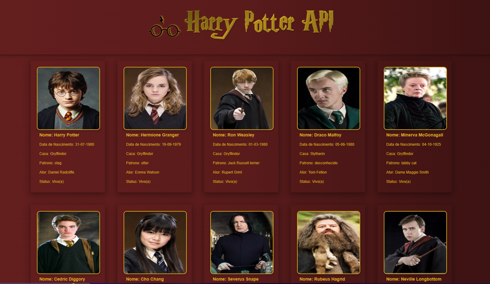

# Harry Potter SPA




## 📙 Sobre o projeto

- Este projeto foi feito com intuito de consumir uma API utilizando React, no  caso a [API de personagens de Harry Potter](https://hp-api.onrender.com/api/characters) e exibir:
Imagem, Nome, Data de Nascimento, Casa, Patrono, Ator e se está vivo.


### 📋 Pré-requisitos

- Uma máquina com um sistema operacional( Linux , Mac, Windows)
- Node instalado
- Npm Instalado

### 🔧 Instalação

Rode o comando:

```
npm install
```

logo após, rode o comando para executar o projeto localmente:

```
npm run dev
```


## 📦 Implantação

- 


